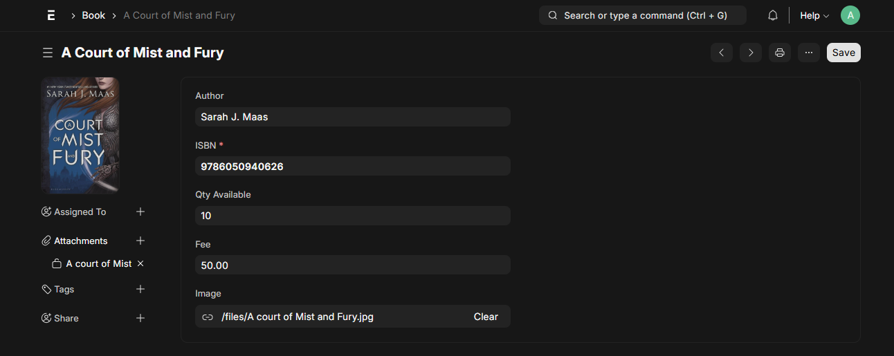

# Library Management System (Frappe / ERPNext)

This is a simple Frappe-based Library Management System to demonstrate the following:

### Features
- **Books**: Allows a user to add books with rental fees and quantities
- **Members**: Track users and their outstanding amounts
-  **Transactions**: Issue/return books with automatic stock and debt tracking
-  **Payments**: Settle outstanding dues for continued borrowing
-  **Debt Limit**: Prevent issuing if projected debt exceeds set limit

###  How to Run
Clone this repo and follow [Frappe Docker Setup](https://github.com/frappe/frappe_docker) to run locally. Install the `library` app using:

# inside your container or dev env
bench get-app library https://github.com/Asthnesis/library.git

bench --site your-site install-app library

###  Screenshots
- Book

Create a book and set quantity and fee

View all books and available quantity

- Member

View all members and their outstanding amounts

- Issue or Return a book

Fill form details

Submit the form

View transaction list

Quantity reduces by 1 to 9

Do a return

The quantity increments by 1 to 10

Outstanding amount increases by 50

If the member tries to borrow a book that will exceed the fee by 500, a warning is given

A member can clear dues using payment:

Outstanding amount is therefore reduced to 0 and they can borrow another book

###  Tech Stack
- Frappe v15.65.0
- ERPNext v15.58.2
- Python 3.10+

### License

mit
